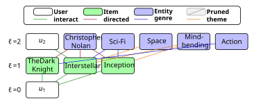
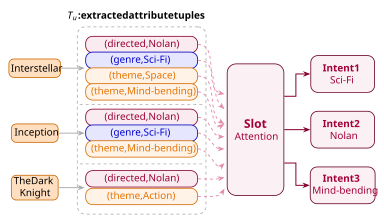
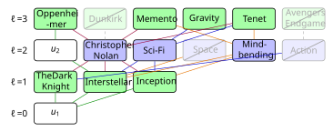

# KISS: Knowledge-aware Intent-guided Subgraph Sampling

Graph-based recommendation model that expands per-user collaborative KG subgraphs, extracts user intents via Slot Attention, and uses intent-conditioned Gumbel-TopK sampling for efficient, personalized subgraph reasoning.

---

## Overview

| (2a) Subgraph Construction | (2b) Intent Modelling | (2c) Intent-guided Sampling |
|:---:|:---:|:---:|
|  |  |  |

**Fig.** For a target user *u₁*, a user-centric computation graph is built via layer-wise CKG expansion **(2a)**. Item attribute tuples are encoded and aggregated into latent intents via Slot Attention **(2b)**. These intents guide adaptive node sampling, yielding a compact but informative subgraph **(2c)**.

---

## Requirements

- Python ≥ 3.10
- NVIDIA GPU with CUDA 12.x

---

## Clone

```bash
git clone https://github.com/edithh81/GraphKISS.git
cd GraphKISS
```

---

## Installation

### Script (recommended)

```bash
bash scripts/install.sh        # CUDA 12.8 (default)
bash scripts/install.sh cu121  # CUDA 12.1
```

The script auto-installs `uv` if not present and falls back to plain `venv + pip` if that fails. A `.venv` environment is created in the project root.

### Manual (Python 3.12 venv)

```bash
python3.12 -m venv .venv
source .venv/bin/activate

# PyTorch 2.8 + CUDA 12.8
pip install torch==2.8.0 torchvision torchaudio \
    --index-url https://download.pytorch.org/whl/cu128

# torch-scatter
pip install torch-scatter \
    -f https://data.pyg.org/whl/torch-2.8.0+cu128.html

# Other dependencies
pip install numpy scipy tqdm pyyaml
```

> For CUDA 12.1 replace `cu128` → `cu121` and `torch==2.8.0` → `torch==2.3.1`.

---

## Data

Place each dataset under `data/<name>/`. The repo ships with four datasets:

```
data/
├── last-fm/
├── amazon-book/
├── new_last-fm/       # inductive split variant
└── new_amazon-book/   # inductive split variant
```

Each directory contains `train.txt` (or `train_1.txt` for `new_*`), the corresponding test file, `kg.txt`, and entity/relation lists.

---

## Training

```bash
python train.py --data_path data/last-fm/ --config configs/last-fm.yaml --gpu 0
```

Or use the helper script:

```bash
bash scripts/run_single.sh last-fm 0
```

Supported datasets and their config files:

| Dataset | Config |
|---|---|
| Last-FM | `configs/last-fm.yaml` |
| Amazon-Book | `configs/amazon-book.yaml` |
| Last-FM (inductive) | `configs/new_last-fm.yaml` |
| Amazon-Book (inductive) | `configs/new_amazon-book.yaml` |

---

## Config Reference

All hyperparameters live in `configs/<dataset>.yaml`. Key parameters:

| Parameter | Description |
|---|---|
| `K` | Max nodes kept per user subgraph per layer |
| `K_ppr` | PPR-based edge budget per (batch, head, rel) group |
| `K_intent` | Number of intent slots |
| `n_layer` | GNN hops |
| `hidden_dim` | Node/relation embedding dimension |
| `lr` | Learning rate |
| `epochs` | Training epochs |
| `lambda_intent_div` | Weight for intra-user intent diversity loss |
| `lambda_centroid_ortho` | Weight for cross-user centroid orthogonality loss |
| `tau_s` / `tau_p` | Sampling / prediction logsumexp temperature |

---

## Results

Outputs are written automatically:

| Path | Contents |
|---|---|
| `results/<dataset>_perf.txt` | Per-epoch Recall@20 and NDCG@20 |
| `results/checkpoints/<dataset>_best.pt` | Best model checkpoint |
| `results/ppr_cache/` | Precomputed PPR scores (reused across runs) |

---

## License

Apache License 2.0 — see [LICENSE](LICENSE).
